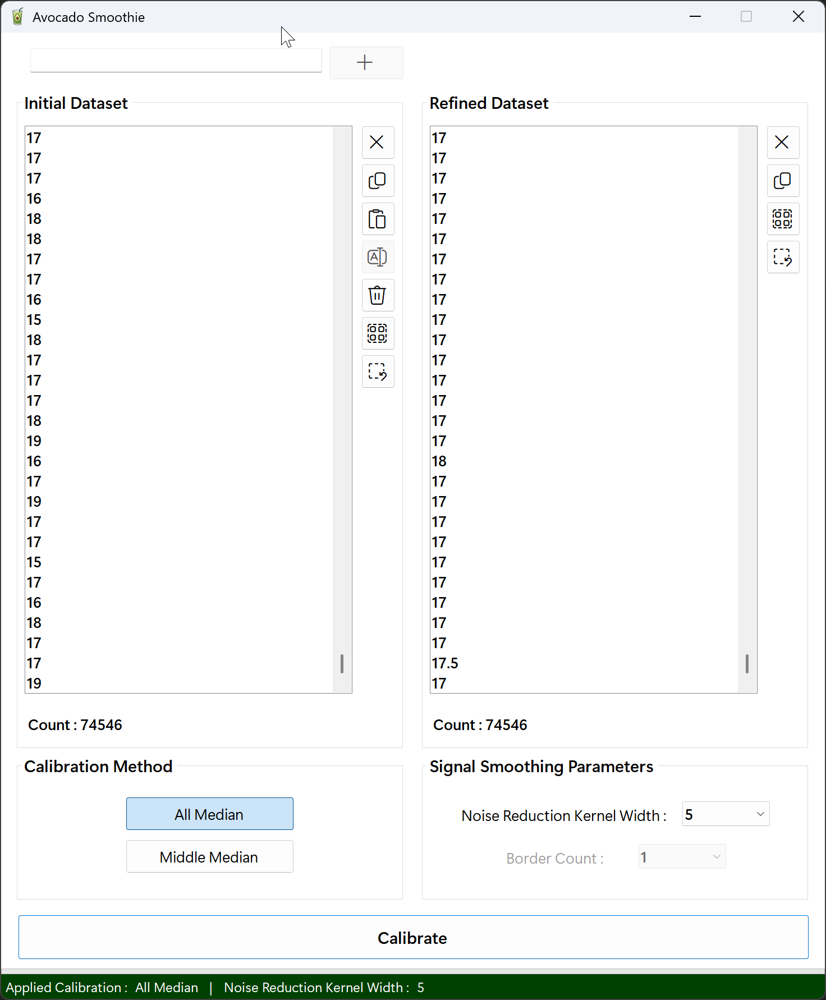
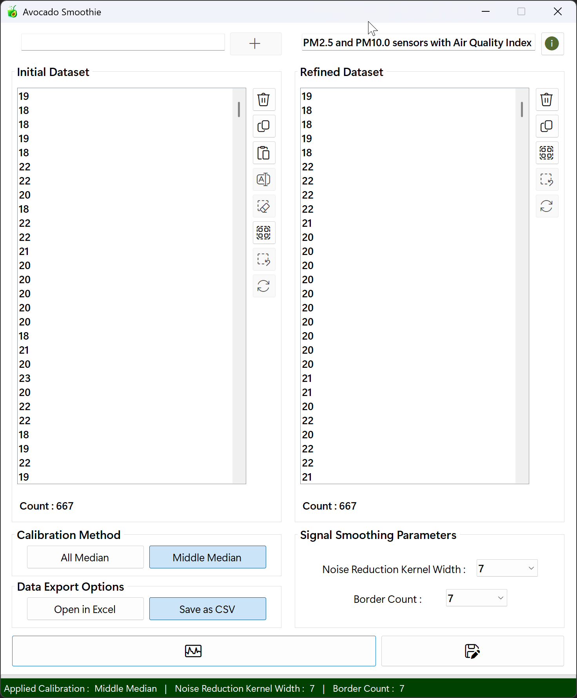
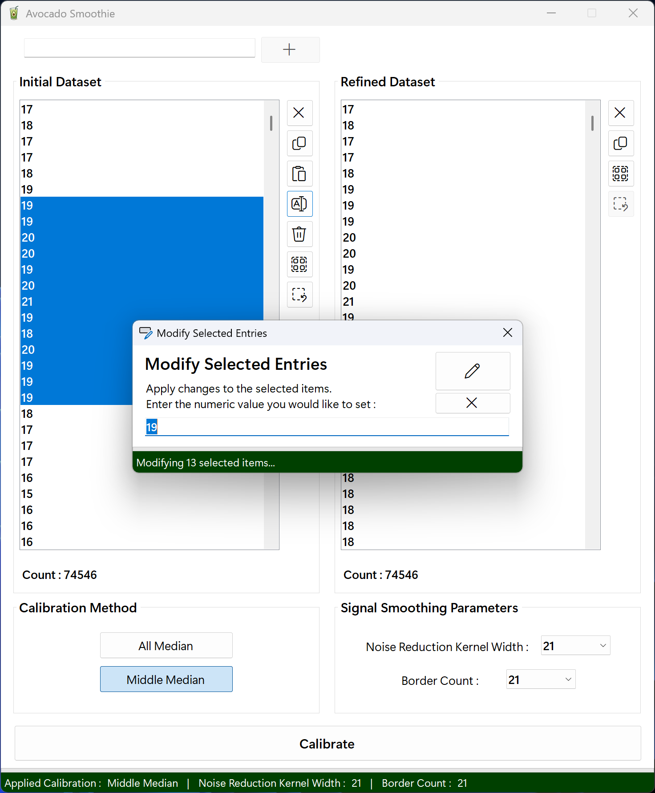

# AvocadoSmoothie
## AvocadoSmoothie : The Art of Data Refinement That Preserves Only the Core
**AvocadoSmoothie** captures the essence of nature's avocado and the softness of a smoothie. Built on the running median algorithm, this project carefully extracts true signals from noisy data : just as only the pit remains at the center of a ripe avocado, leaving behind rough skins and excess in the blender.

**Key components**
- **Avocado** : Symbolizes a careful approach that targets only the central values of data, much like the dense seed hidden deep inside the fruit.
- **Smoothie** : Represents the graceful flow of an algorithm that blends complexity into a seamless whole, just like diverse ingredients harmonizing into one smooth drink.

**Technical Aesthetics**
- **RunningMedian** : Delivers stability and reliability by maintaining the central tendency, even in the face of abrupt spikes.

**Philosophical Foundation**
- **Gentle Refinement**<br>
Like living organisms, data requires delicate care. AvocadoSmoothie follows a soft-touch philosophy to ensure vital patterns aren’t damaged by excessive processing.

- **Harmony Between Responsiveness and Stability**<br>
Like a well-balanced smoothie in taste and texture, this project aims to respond swiftly while also withstanding sudden fluctuations.

- **Clarity Through Vitality**<br>
By removing noise, AvocadoSmoothie breathes clarity and energy into your analysis : leading to better decisions and deeper insights, all through a nutritious blending process.

## Project Overview
This AvocadoSmoothie project delivers a highly optimized running median filter on numeric data held in a `ListBox`. Users pick a `kernel width` and `border count`, then choose between two modes :<br><br>

- **AllMedian** : applies the median filter at every index, clamping the window at the ends for out-of-range safety.<br>
- **MiddleMedian** : preserves the specified number of leading and trailing values, filtering only the central section.<br><br>

Data can be entered one value at a time, bulk-pasted from the clipboard, or drag-and-dropped (with HTML-aware parsing). Internally, each sliding window is copied into a thread-local buffer, sorted via a recursive Quicksort, and its median extracted. Filtering is parallelized across CPU cores using `Parallel.For` for maximum throughput.<br><br>
A real-time ProgressBar keeps the user informed, and UI updates (copy, delete, select-all, paste) are batched with `BeginUpdate` / `EndUpdate` to eliminate flicker. After each run, source and result lists are reset to guarantee repeatable behavior, making it effortless to visualize noise reduction or signal smoothing on the fly.<br><br>

> **Disclaimer :** This implementation uses a plain (equal-weight) median filter. For weighted-median calculations and a wider range of smoothing / correction methods, please refer to the **[SonataSmooth](https://github.com/happybono/SonataSmooth)** project. 

<br>

<div align="center">
 


</div>

<br>

## What's New
<details>
<summary>Click to Expand</summary>

### v1.0.0.0
#### February 16, 2022
> Initial release.

#### February 17, 2022
> Fixed several bugs.

#### March 06, 2022
> Hi-DPI monitors support.

### v2.0.0.0
#### July 20, 2025
> Overhauled the graphical user interface.<br><br>
> Configurable `kernel width` and `border count` (combo‐boxes).<br><br>
> Regex utilities for numeric / HTML parsing.<br><br>
> Progress reporting via `ProgressBar` and `IProgress(Of Integer)`.<br><br>
> Async UI integration (`Async / Await` + `Task.Run`).<br><br>
> Thread‐local buffers and parallel loops (`Parallel.For`).<br><br>
> Replaced hard‐coded 5-point windows with parameterized `ComputeMedians`.<br><br>
> Switched from single‐threaded loops to `Parallel.For`.<br><br>
> Unified median logic : introduced `MedianOf5`, `GetWindowMedian`.<br><br>
> Bulk result population with `ListBox.Items.AddRange`.<br><br>
> Selection handlers to enable / disable edit, copy, delete and clear buttons.<br><br>
> Fully non-blocking median computation.<br><br>
> Dynamic window size reduces overhead.<br><br>
> Real‐time progress feedback (`ProgressBar`).<br><br>
> `StatusStrip` shows mode, `kernel width` and `border count`.

### v2.1.1.0
#### July 21, 2025
> Updated copy behavior : even when items aren't fully selected, pressing the copy button or using the shortcut (Ctrl + C) will copy all entries.<br>
(If only some items in the `ListBox` are selected, only those selected items will be copied.)<br><br>
> Minor bugs fixed.

### v2.1.2.0
#### July 22, 2025
> Improved bulk deletion performance in ListBox by optimizing the deletion logic for full selection scenarios.<br><br>
> Added a fast path to instantly clear all items and reset the progress bar when all entries are selected.<br><br>
> Ensured the progress bar and UI remain responsive during partial deletions of large datasets.<br><br>
> Minor bugs fixed.

### v2.2.3.0
#### July 22, 2025
> Refactored the pasteButton_Click handler to use PLINQ-based parallel parsing.<br><br>
> Optimized bulk insertion by replacing per-item adds with ListBox1.Items.AddRange.<br><br>
> Removed Task.Yield calls to eliminate unnecessary context switches.<br><br>
> Updated progress bar steps to 0 → 10 → 30 → 70 → 100 for clearer feedback.<br><br>
> Added enable / disable logic for Calculate, Copy, and Delete buttons to boost UI responsiveness and overall performance.

### v.3.0.0.0
#### July 25, 2025
> Renamed all code elements, file names, and app metadata to reflect the new project name.<br><br>
> The project has been rebranded under its distinctive new name.<br><br>
> A new GitHub repository named AvocadoSmoothie has been created, and all necessary files have been relocated to it<br><br>
> The existing [RunningMedian](https://github.com/happybono/RunningMedian/) repository has been set to private.
</details>

## Features
- Import numeric data effortlessly via copy / paste or drag-and-drop from Excel and other spreadsheet apps (HTML / text parsing built-in).
- Choose kernel width and border count, then click `Calculate` button to apply the running median filter.
- Two filter modes : **MiddleMedian** (preserve first / last values) or **AllMedian** (full-range smoothing).
- High-performance parallel processing with a thread-local buffer and recursive `QuickSort`.
- Real-time `ProgressBar` feedback and flicker-free UI updates using `BeginUpdate` / `EndUpdate.`
- Source and result lists reset after each run for consistent, repeatable behavior.

## Features & Algorithms
### 1. Initialization & Input Processing
#### How it works
When the application starts, users can input numeric data through various methods: direct text entry, clipboard paste, or drag-and-drop. The input values are parsed and stored in the internal sourceList, and displayed in ListBox1 for review and editing.

#### Principle
-	Input data is added to `ListBox1` and internally stored in the sourceList list.
-	Input can be received via the textbox, clipboard, or drag-and-drop.
-	Only numeric values are extracted using regular expressions for robust parsing.

#### Code Implementation
```vbnet
' Add value from TextBox
Private Sub addButton_Click(sender As Object, e As EventArgs) Handles addButton.Click
    ListBox1.Items.Add(Val(TextBox1.Text))
    TextBox1.Text = String.Empty
    lblCnt1.Text = "Count : " & ListBox1.Items.Count
    copyButton1.Enabled = ListBox1.Items.Count > 0
End Sub

' Paste from clipboard
Private Async Sub pasteButton_Click(sender As Object, e As EventArgs) Handles pasteButton.Click
    Dim raw = My.Computer.Clipboard.GetText()
    Dim nums = Await Task.Run(Function()
        Return regexNumbers.Matches(raw).Cast(Of Match)().Select(Function(m) Double.Parse(m.Value)).ToArray()
    End Function)
    ' ... (Add to ListBox1)
End Sub

' Drag-and-drop input
Private Async Sub ListBox1_DragDrop(sender As Object, e As DragEventArgs) Handles ListBox1.DragDrop
    ' ... (Extract numbers from HTML / Text and add to ListBox1)
End Sub
```

### 2. AllMedian Calculation
#### How it works
For every data point, the algorithm calculates the median of a window of values centered at that point, with the window size defined by `kernelWidth`. At the boundaries, the window is automatically adjusted to fit within the data range.

#### Principle
-	For each index, a window is defined and the median is computed by sorting the window values.<br>
-	Parallel processing (`Parallel.For`) is used for efficient computation on large datasets.<br>
-	The results are stored in `medianList`.<br><br>

#### Code Implementation
```vbnet
Sub AllMedian()
    Dim n = sourceList.Count
    If n = 0 Then Return

    Dim arr = sourceList.ToArray()
    Dim buffer(n - 1) As Double

    Parallel.For(0, n, Sub(i)
        Dim iMin = If(i < 2, 0, i - 2)
        Dim iMax = If(i > n - 3, n - 1, i + 2)
        Dim win(4) As Double
        Dim k = 0
        For j = iMin To iMax
            win(k) = arr(j)
            k += 1
        Next
        Quicksort(win, 0, 4)
        buffer(i) = win(2)
    End Sub)

    medianList.Clear()
    medianList.AddRange(buffer)
End Sub
```
-	Related variables: sourceList, medianList, kernelWidth

### 3. MiddleMedian Calculation
#### How it works
The median filter is applied only to the inner region of the data, excluding a specified number of boundary elements (`borderCount`). The boundary values are copied as-is, while the inner region is processed in parallel to compute the median.

#### Principle
-	The first and last `borderCount` elements are copied directly from the original data.
-	The median filter is applied only to the indices between the boundaries.
-	Parallel processing is used for performance.

#### Code Implementation
```vbnet
Sub MiddleMedian()
    Dim n = sourceList.Count
    If n = 0 Then Return

    Dim arr = sourceList.ToArray()
    Dim buffer(n - 1) As Double

    ' Copy boundary elements
    buffer(0) = arr(0)
    If n > 1 Then buffer(1) = arr(1)
    If n > 2 Then buffer(n - 2) = arr(n - 2)
    buffer(n - 1) = arr(n - 1)

    ' Apply median filter to inner region
    Parallel.For(2, n - 2, Sub(i)
        Dim win(4) As Double
        For k = 0 To 4
            win(k) = arr(i + k - 2)
        Next
        Quicksort(win, 0, 4)
        buffer(i) = win(2)
    End Sub)

    medianList.Clear()
    medianList.AddRange(buffer)
End Sub
```

### Results Aggregation & UI Update
#### How it works
After the median calculation, the results are displayed in `ListBox2`. The UI is updated to reflect the new data, including count labels and enabling relevant buttons. Progress is shown during computation for better user experience.

#### Principle
-	The computed median values are copied to `ListBox2` for user review.
-	UI elements such as labels and buttons are updated based on the current state.
-	Progress bars and status labels provide feedback during long computations.

#### Code Implementation
```vbnet
' Display results in ListBox2
Sub DisplayResults()
    ListBox2.BeginUpdate()
    For Each v As Double In medianList
        ListBox2.Items.Add(v)
    Next
    ListBox2.EndUpdate()
End Sub

' Main calculation and UI update
Private Async Sub calcButton_Click(sender As Object, e As EventArgs) Handles calcButton.Click
    ' ... (Prepare data and parameters)
    Await Task.Run(Sub()
        ComputeMedians(
            useMiddle:=useMiddle,
            kernelWidth:=kernelWidth,
            borderCount:=borderCount,
            progress:=progress)
    End Sub)

    ' Update ListBox2 and UI
    ListBox2.BeginUpdate()
    ListBox2.Items.Clear()
    ListBox2.Items.AddRange(medianList.Cast(Of Object)().ToArray())
    ListBox2.EndUpdate()
    ' ... (Update labels, progress bar, etc.)
End Sub
```

### Data Handling and Processing
- Efficiently processes numeric data for running median calculations
- Supports data input via :
  - Direct entry
  - Clipboard paste
  - Drag-and-drop
- Validates numeric values using regular expressions
- Stores data as a list of doubles for high-precision calculations
- Provides two types of running median filters :
  - `AllMedian`:
    - Calculates median at every position using a sliding window
    - Automatically adjusts at dataset boundaries
  - `MiddleMedian`:
    - Applies median only to the inner region of data
    - Leaves a user-defined number of boundary elements untouched
- Implements parallel processing for fast performance on large datasets
- Results stored separately for review, copy, or export

### User Interface and Interaction
- Main window includes :
  - `ListBox` for input data
  - `ListBox` for displaying results
- Data points can be :
  - Added, edited, or deleted via buttons or keyboard shortcuts
- Bulk editing supported via modal dialog for multi-value modification
- Data selection, copying, and clearing available via one-click or keyboard shortcuts
- Real-time feedback provided through `ProgressBars` and `StatusLabels`
- Interface dynamically enables / disables controls based on context to prevent errors

### Customization and Configuration
- `Kernel (window) width` adjustable for filtering
- Boundary exclusion configurable when using MiddleMedian
- Filter type (`AllMedian` or `MiddleMedian`) can be switched using radio buttons
- Interface auto-adjusts available settings to match selected filter
- All settings applied instantly for immediate data visualization and experimentation

## Conclusion
This AvocadoSmoothie application combines robust data handling, a user-friendly interface, and flexible configuration options to deliver fast and accurate median filtering for numeric datasets. Its support for large-scale data, parallel processing, and real-time feedback makes it suitable for a wide range of data analysis and preprocessing tasks. Whether for exploratory analysis or as part of a larger workflow, this AvocadoSmoothie project provides a reliable and efficient solution for running median calculations.

## Principle Demonstration
<div align="center">
  <a href="https://vimeo.com/693794659" title="Data Calibration Demo Using the running median Method - Click to Watch">
    
  </a>
</div>

## Demonstration
<br><br>
<br><br>


## License
This project is licensed under the MIT License. See the `LICENSE` file for details.

## Copyright 
Copyright ⓒ HappyBono 2022 - 2025. All Rights Reserved.
