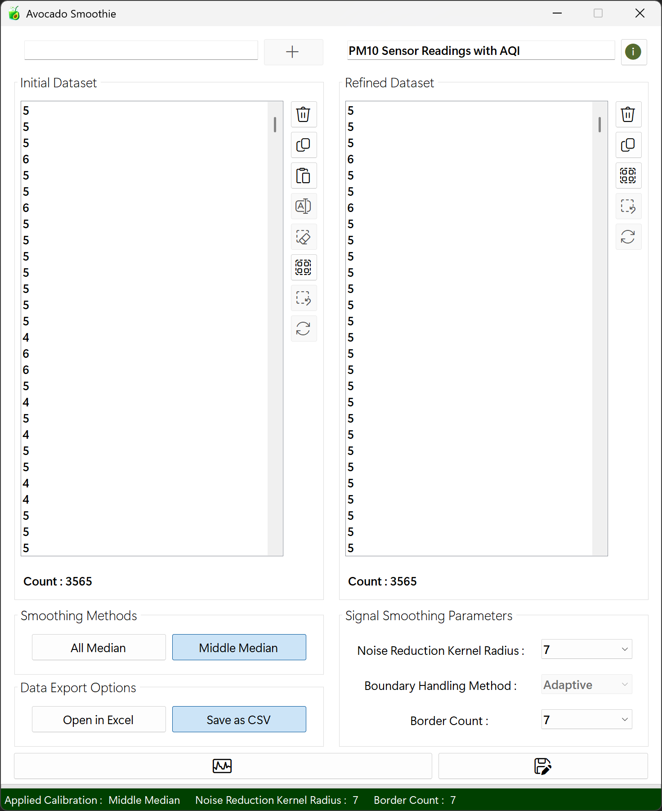
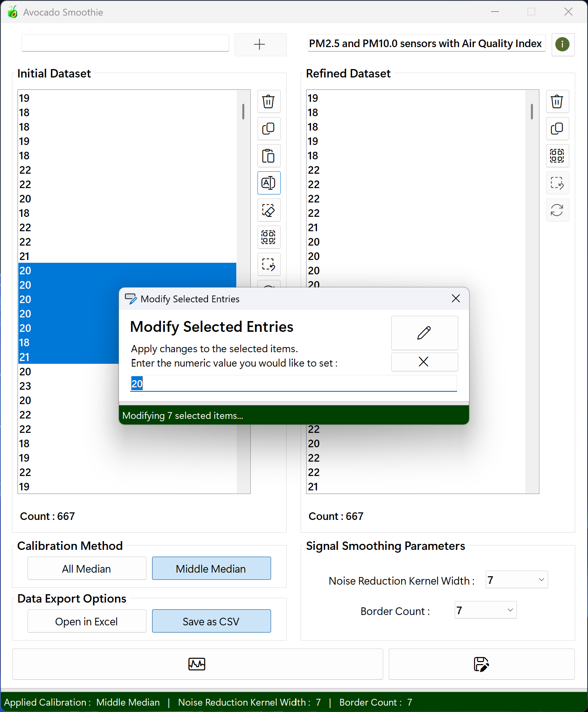
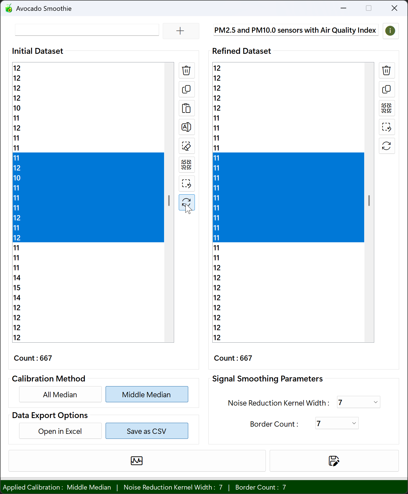
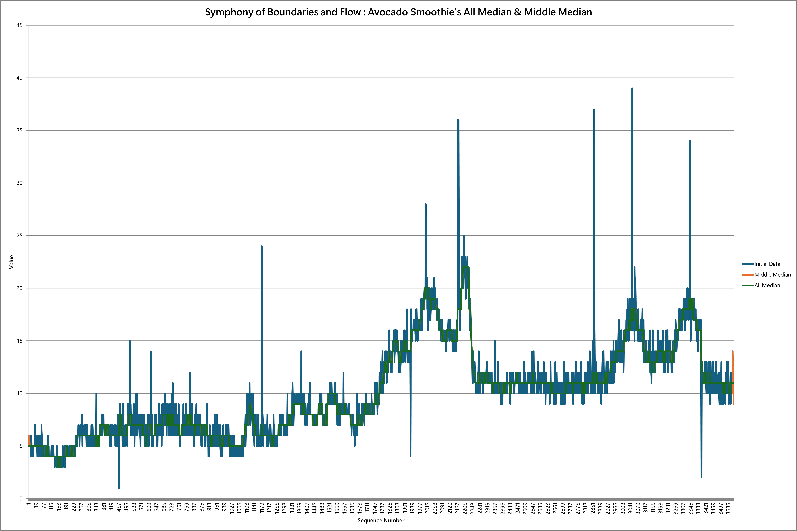

# AvocadoSmoothie
## The Art of Data Refinement That Preserves Only the Core
**AvocadoSmoothie** captures the essence of nature's avocado and the softness of a smoothie. Built on the running median algorithm, this project carefully extracts true signals from noisy data : just as only the pit remains at the center of a ripe avocado, leaving behind rough skins and excess in the blender.

**Key components**
- **Avocado** : Symbolizes a careful approach that targets only the central values of data, much like the dense seed hidden deep inside the fruit.
- **Smoothie** : Represents the graceful flow of an algorithm that blends complexity into a seamless whole, just like diverse ingredients harmonizing into one smooth drink.

**Technical Aesthetics**
- **RunningMedian** : Delivers stability and reliability by maintaining the central tendency, even in the face of abrupt spikes.

**Philosophical Foundation**
- **Gentle Refinement**<br>
Like living organisms, data requires delicate care. AvocadoSmoothie follows a soft-touch philosophy to ensure vital patterns aren't damaged by excessive processing.

- **Harmony Between Responsiveness and Stability**<br>
Like a well-balanced smoothie in taste and texture, this project aims to respond swiftly while also withstanding sudden fluctuations.

- **Clarity Through Vitality**<br>
By removing noise, AvocadoSmoothie breathes clarity and energy into your analysis : leading to better decisions and deeper insights, all through a nutritious blending process.

## Project Overview
This AvocadoSmoothie project delivers a highly optimized running median filter on numeric data held in a `ListBox`. Users pick a `kernel radius` and `border count`, then choose between two modes :<br><br>

- **AllMedian** : applies the median filter at every index, clamping the window at the ends for out-of-range safety.<br>
- **MiddleMedian** : preserves the specified number of leading and trailing values, filtering only the central section.<br><br>

Data can be entered one value at a time, bulk-pasted from the clipboard, or drag-and-dropped (with HTML-aware parsing). Internally, each sliding window is copied into a thread-local buffer, sorted via a recursive Quicksort, and its median extracted. Filtering is parallelized across CPU cores using `Parallel.For` for maximum throughput.<br><br>
A real-time ProgressBar keeps the user informed, and UI updates (copy, delete, select-all, paste) are batched with `BeginUpdate` / `EndUpdate` to eliminate flicker. After each run, source and result lists are reset to guarantee repeatable behavior, making it effortless to visualize noise reduction or signal smoothing on the fly.<br><br>

> **Disclaimer :** This implementation uses a plain (equal-weight) median filter. For weighted-median calculations and a wider range of smoothing / correction methods, please refer to the **[SonataSmooth](https://github.com/happybono/SonataSmooth)** project. 

<br>

<div align="center">
 


</div>

<br>

## What's New
<details>
<summary>Click to Expand</summary>

### v1.0.0.0
#### February 16, 2022
> Initial release.

#### February 17, 2022
> Fixed several bugs.

#### March 06, 2022
> Hi-DPI monitors support.

### v2.0.0.0
#### July 20, 2025
> Overhauled the graphical user interface.<br><br>
> Configurable `kernel width` and `border count` (combo‐boxes).<br><br>
> Regex utilities for numeric / HTML parsing.<br><br>
> Progress reporting via `ProgressBar` and `IProgress(Of Integer)`.<br><br>
> Async UI integration (`Async / Await` + `Task.Run`).<br><br>
> Thread‐local buffers and parallel loops (`Parallel.For`).<br><br>
> Replaced hard‐coded 5-point windows with parameterized `ComputeMedians`.<br><br>
> Switched from single‐threaded loops to `Parallel.For`.<br><br>
> Unified median logic : introduced `MedianOf5`, `GetWindowMedian`.<br><br>
> Bulk result population with `ListBox.Items.AddRange`.<br><br>
> Selection handlers to enable / disable edit, copy, delete and clear buttons.<br><br>
> Fully non-blocking median computation.<br><br>
> Dynamic window size reduces overhead.<br><br>
> Real‐time progress feedback (`ProgressBar`).<br><br>
> `StatusStrip` shows mode, `kernel width` and `border count`.

### v2.1.1.0
#### July 21, 2025
> Updated copy behavior : even when items aren't fully selected, pressing the copy button or using the shortcut (Ctrl + C) will copy all entries.<br>
(If only some items in the `ListBox` are selected, only those selected items will be copied.)<br><br>
> Minor bugs fixed.

### v2.1.2.0
#### July 22, 2025
> Improved bulk deletion performance in ListBox by optimizing the deletion logic for full selection scenarios.<br><br>
> Added a fast path to instantly clear all items and reset the progress bar when all entries are selected.<br><br>
> Ensured the progress bar and UI remain responsive during partial deletions of large datasets.<br><br>
> Minor bugs fixed.

### v2.2.3.0
#### July 22, 2025
> Refactored the pasteButton_Click handler to use PLINQ-based parallel parsing.<br><br>
> Optimized bulk insertion by replacing per-item adds with ListBox1.Items.AddRange.<br><br>
> Removed Task.Yield calls to eliminate unnecessary context switches.<br><br>
> Updated progress bar steps to 0 → 10 → 30 → 70 → 100 for clearer feedback.<br><br>
> Added enable / disable logic for Calculate, Copy, and Delete buttons to boost UI responsiveness and overall performance.

### v3.0.0.0
#### July 25, 2025
> Renamed all code elements, file names, and app metadata to reflect the new project name.<br><br>
> The project has been rebranded under its distinctive new name.<br><br>
> A new GitHub repository named AvocadoSmoothie has been created, and all necessary files have been relocated to it<br><br>
> The existing [RunningMedian](https://github.com/happybono/RunningMedian/) repository has been set to private.

### v3.1.0.0
#### July 25, 2025
> Replaced unsafe Val() parsing with Double.TryParse() to prevent overflow and ensure robust input validation.<br><br>
> Minor bugs fixed.

### v4.0.0.0
#### August 03, 2025
> Added `FrmAbout` displaying app version and copyright information.<br><br>
> Added `Buy Me a Coffee` feature via PayPal, integrated directly into the `FrmAbout` to support the developer.<br><br>

### v4.2.3.0
#### August 03, 2025
> Minor bugs fixed.

### v4.2.3.2
#### August 05, 2025
> Minor bugs fixed.

### v4.2.6.7
#### August 10, 2025
> The code has been refactored, and variable names have been redefined for improved clarity.<br><br>
> Include an ARM64-native variant of the executable.

### v4.2.7.0
#### August 15, 2025
> Updated UI labels by replacing "Kernel Width" with the more precise "Kernel Radius".<br><br>
> Refactored variable names and code references to use "Kernel Radius (r)" instead of "Kernel Width (w)".<br><br>
> Removed unnecessary `Task.Yield` calls to eliminate extra context switches and improve execution efficiency.<br><br>
> Improved Microsoft Office (Excel) installation detection and exception handling robustness.
> Minor bugs fixed.

### v4.3.0.0
#### August 20, 2025
> Implemented explicit COM object cleanup (`Application`, `Workbook`, `Worksheet`) with `Marshal.ReleaseComObject` and forced GC to prevent memory leaks and lingering background Excel processes.<br><br>
> Minor bugs fixed.

### v4.3.1.0
#### August 21, 2025
> Removed unused functions to streamline the codebase.<br><br>
> Retained early-stage/draft code as commented-out sections for reference and potential future use.<br><br>
> Minor bugs fixed.
 
### v4.6.3.8
#### August 24, 2025  
> Renamed UI controls for clarity and consistency (e.g., `ListBox1` → `lbInitData`).<br><br>
> Added dynamic description label (`slblDesc`) and tooltip support for better user guidance.<br><br>
> Deprecated `MiddleMedian()` and `AllMedian()` functions; replaced with unified `ComputeMedians()` logic.<br><br>
> Enhanced Excel export with metadata (title, author, comments) and fun flavor-based messages.<br><br>
> Improved error handling for Excel export (COM errors, permission issues, etc.).<br><br>
> Unified progress bar usage (`pbMain`) across calibration and export processes.<br><br>
> Improved selection synchronization and feedback between datasets.<br><br>
> Minor bugs fixed.

### v4.6.3.9
#### August 26, 2025
> Refreshed the graphical user interface with subtle enhancements.<br><br>
> Improved status label messaging logic : Added dynamic singular / plural phrasing and corrected punctuation for clearer user feedback.<br><br>
> Minor bugs fixed.

### v4.6.5.0
#### August 28, 2025
>	Implemented dataset title validation : including checks for length, invalid characters, and reserved names. Alongside dynamic placeholder behavior and conditional enabling of the export button.

### v4.6.5.1
#### September 2, 2025
> Minor bugs fixed.
</details>

### v4.6.6.0
#### September 2, 2025
> With the transition to ARM64 native based on `.NET Framework 4.8.1`, PCs running in this environment now deliver improved performance.<br><br>
> Since version v4.6.3.8, the correction value miscalculated when selecting the MiddleMedian method has been fixed to calculate correctly.

## Required Components & Setup
### Prerequisites
- [.NET Framework 4.7.2](https://dotnet.microsoft.com/en-us/download/dotnet-framework/net472) or later ([.NET Framework 4.8](https://dotnet.microsoft.com/en-us/download/dotnet-framework/net48) recommended)
- Windows Operating System (Windows 10 or later recommended)
- [Visual Studio 2019 or newer](https://visualstudio.microsoft.com/) (for development)
- [Microsoft Office (Excel)](https://www.microsoft.com/en/microsoft-365/) - **Required for Microsoft Excel export functionality** via `Interop`

### Dependencies
- `System.Windows.Forms`
- `System.Threading.Tasks`
- `System.Linq`
- `Microsoft.Office.Interop.Excel` (for Excel export)

### Initial Setup
- Clone or download the repository.
- Open the solution file (`.sln`) in Visual Studio.
- Add necessary references if required.
- Build the project.
- Run the application.

## Execution Instructions
1. **Launch the Application** : Run the compiled `.exe` file or start the project from Visual Studio.
2. **Input Data** : Enter numeric values manually, paste from clipboard, or drag-and-drop text / HTML.
3. **Select Filter** : Choose a smoothing algorithm and configure kernel width and border count.
4. **Calibrate** : Click the 'Calibrate' button to apply the selected filter.
5. **Review Results** : View the smoothed output in the second listbox.
6. **Export** : Click Export to save results as `.CSV` or `Excel (.xlsx)`, with optional chart visualization.

## Pascal Weighted Median vs. Standard Median
### Which Types of Graphs Benefit from Each Method?
| Graph Type              | Standard Median      | Pascal Weighted Median    |
|:------------------------|:---------------------|:--------------------------|
| Occasional Noise        | Effective            | Effective                 |
| Frequent Noise          | Strong filtering     | Sensitive to distortions  |
| High local variation    | Can suppress trends  | Captures trends well      |
| Sudden spikes           | Ignores outliers well| May amplify outliers      |

- The **standard median** is great for filtering noise in data with frequent or unpredictable spikes : such as images or sensor readings.
- The **Pascal theory based weighted median** shines when the data has meaningful local structure, like time series that need trend preservation.

### Why Is the Pascal Triangle Weighted Median More Sensitive to Noise?
A **Pascal triangle–based weighted median** assigns weights to each element : typically giving higher weight to values near the center of the window.

- Advantage : Better preserves local trends within the data.
- Downside : Noisy spikes near the center get too much influence, leading to distortion.

In comparison:
- A **[standard median](https://github.com/happybono/AvocadoSmoothie/)** simply picks the middle value, so random spikes are more easily ignored.
- A **[weighted median](https://github.com/happybono/SonataSmooth/)**, especially with Pascal-style weights, might over-represent noisy points if they're close to the center.

### Which Method Is Commonly Used in Practice?
Depending on the field, practitioners choose based on context :

- Image processing / video filtering
  - Standard median is widely used
  - Removes salt-and-pepper noise effectively

- Time-series smoothing (e.g. stock prices, IoT sensors, EEG signals)
  - Weighted approaches, including Pascal triangle, are preferred
  - Smooths data while preserving trends

- Experimental data correction
  - Often combines both methods
  - Hybrid strategies handle complex noise patterns more flexibly

## Features
- Import numeric data effortlessly via copy / paste or drag-and-drop from Excel and other spreadsheet apps (HTML / text parsing built-in).
- Choose kernel width and border count, then click `Calculate` button to apply the running median filter.
- Two filter modes : **MiddleMedian** (preserve first / last values) or **AllMedian** (full-range smoothing).
- High-performance parallel processing with a thread-local buffer and recursive `QuickSort`.
- Real-time `ProgressBar` feedback and flicker-free UI updates using `BeginUpdate` / `EndUpdate.`
- Source and result lists reset after each run for consistent, repeatable behavior.

## Features & Algorithms
### 1. Initialization & Input Processing
#### How it works
When the application starts, users can input numeric data through various methods : direct text entry, clipboard paste, or drag-and-drop. The input values are parsed and stored in the internal sourceList, and displayed in ListBox1 for review and editing.

#### Principle
-	Input data is added to `ListBox1` and internally stored in the sourceList list.
-	Input can be received via the textbox, clipboard, or drag-and-drop.
-	Only numeric values are extracted using regular expressions for robust parsing.

#### Code Implementation
```vbnet
' Add value from TextBox
Private Sub addButton_Click(sender As Object, e As EventArgs) Handles addButton.Click
    ListBox1.Items.Add(Val(TextBox1.Text))
    TextBox1.Text = String.Empty
    lblCnt1.Text = "Count : " & ListBox1.Items.Count
    copyButton1.Enabled = ListBox1.Items.Count > 0
End Sub

' Paste from clipboard
Private Async Sub pasteButton_Click(sender As Object, e As EventArgs) Handles pasteButton.Click
    Dim raw = My.Computer.Clipboard.GetText()
    Dim nums = Await Task.Run(Function()
        Return regexNumbers.Matches(raw).Cast(Of Match)().Select(Function(m) Double.Parse(m.Value)).ToArray()
    End Function)
    ' ... (Add to ListBox1)
End Sub

' Drag-and-drop input
Private Async Sub ListBox1_DragDrop(sender As Object, e As DragEventArgs) Handles ListBox1.DragDrop
    ' ... (Extract numbers from HTML / Text and add to ListBox1)
End Sub
```

### 2. What is Kernel Radius
#### Definition
In a median filter, `kernelRadius` specifies how many elements are taken on each side of the center element when creating the median window.
  
#### Kernel Size Formula
The width of a kernel is calculated using the following formula :

$$
\text{kernelWidth} = 2 \times \text{kernelRadius} + 1
$$

#### Example
If the kernel radius is **2**, then :

$$
\text{kernelWidth} = 2 \times 2 + 1 = 5
$$

Therefore, the kernel width is **5**.

#### Meaning
- The filter includes the current element plus `kernelRadius` elements before it and after it.
- This ensures the total window size is always odd, so there's a single middle value.

#### Benefit
- `kernelRadius` makes it easy to reason about how far to extend the filter around the center point.
- It helps in handling edge conditions without ambiguity.

### 3. AllMedian Calculation
#### How it works
AllMedian applies a median filter across every data point in the source list using a symmetric window of size `2 × kernelRadius + 1`. Internally it invokes a single routine, `ComputeMedians(useMiddle:=False, ...)`, which :

- Spawns a thread-local buffer for the sliding window
- Parallelizes each index's window extraction and median computation
- Reports progress back to the UI

#### Principle
- Compute window parameters :
  - kernelWidth = 2 * kernelRadius + 1
  - offsetLow = (kernelWidth - 1) \ 2
  - offsetHigh = (kernelWidth - 1) - offsetLow
- For each index i in [0 … n - 1] :
  1. iMin = Max(0, i - offsetLow) iMax = Min(n - 1, i + offsetHigh)
  2. Copy arr(iMin … iMax) into a thread-local array win
  3. Sort the slice and pick its median via GetWindowMedian
      - Odd-length windows → middle element
      - Even-length windows → average of two middle values

#### Code Implementation
```vbnet
' All-points median smoothing
ComputeMedians(useMiddle:=False,
               KernelRadius:=kernelWidth,
               borderCount:=0,
               progress:=progress)

Private Sub ComputeMedians(useMiddle As Boolean,
                           KernelRadius As Integer,
                           borderCount As Integer,
                           progress As IProgress(Of Integer))
    Dim n = sourceList.Count
    If n = 0 Then progress.Report(0) : Return

    Dim arr = sourceList.ToArray()
    Dim buffer(n - 1) As Double
    Dim offsetLow  = (KernelRadius - 1) \ 2
    Dim offsetHigh = (KernelRadius - 1) - offsetLow

    ' Thread-local buffer to avoid per-iteration allocations
    Dim localWin As New ThreadLocal(Of Double())(
        Function() New Double(KernelRadius - 1) {})

    Parallel.For(0, n, Sub(i)
        Dim win    = localWin.Value
        Dim iMin   = Math.Max(0, i - offsetLow)
        Dim iMax   = Math.Min(n - 1, i + offsetHigh)
        Dim length = iMax - iMin + 1

        For k = 0 To length - 1
            win(k) = arr(iMin + k)
        Next

        buffer(i) = GetWindowMedian(win, length)
    End Sub)

    medianList.Clear()
    medianList.AddRange(buffer)
End Sub

Private Function GetWindowMedian(win() As Double, length As Integer) As Double
    Dim slice = win.Take(length).ToArray()
    Array.Sort(slice)
    Dim mid = length \ 2

    If length Mod 2 = 0 Then
        ' even → average two middle elements
        Return (slice(mid - 1) + slice(mid)) / 2.0
    Else
        Return slice(mid)
    End If
End Function
```

### 4. MiddleMedian Calculation
#### How it works
MiddleMedian preserves the first and last `borderCount` elements unchanged, then applies the same median filter only to the inner region. It calls the **same** `ComputeMedians` routine with `useMiddle:=True`.

#### Principle
Copy boundary elements directly :
buffer(0 … borderCount - 1) = arr(0 … borderCount - 1)
buffer(n - 1 … n - borderCount) = arr(n - 1 … n - borderCount)
Run the sliding-window median on indices [borderCount … n - borderCount - 1]
Filtering logic and median selection are identical to `AllMedian`

#### Code Implementation
```vbnet
' Inner-region median smoothing
ComputeMedians(useMiddle:=True,
               KernelRadius:=kernelWidth,
               borderCount:=borderCount,
               progress:=progress)

' Inside ComputeMedians :
If useMiddle Then
    For i = 0 To borderCount - 1
        buffer(i)               = arr(i)
        buffer(n - 1 - i)       = arr(n - 1 - i)
    Next
End If

' Then the Parallel.For loop runs from
'   startIdx = borderCount
'   endIdx   = n - borderCount - 1
' to compute medians on the inner slice only.
```

### 5. Border Count
When you apply the Running Median filter, the **Border Count** parameter lets you exempt a fixed number of points at each end of your series from filtering. This helps you avoid unwanted edge distortion and preserves known "safe" values at the start and finish.

- Definition  
  The number of data points to leave unchanged at both the beginning and the end of the sequence.

- Type  
  Integer, 0 ≤ Border Count < ⌊n / 2⌋

- Default  
  0 (no edge preservation : all points are filtered)

#### Notes

- If your series length is less than 2 × Border Count, the filter will skip processing entirely.  
- Choose a small k (e.g. 1 – 5) when you trust your edge data but still need robust spike suppression in the center.

#### Behavior

If you set `Border Count = k`, then :  
- The first **k** samples remain exactly as they are.  
- The last **k** samples remain exactly as they are.  
- Only the middle section (everything between those preserved edges) is passed through the median filter.

#### Example

```txt
Original data (10 points) :   [x₀, x₁, x₂, x₃, x₄, x₅, x₆, x₇, x₈, x₉]
Border Count = 3

Preserved by Border Count :   [x₀, x₁, x₂]                [x₇, x₈, x₉]
Filtered by Running Median :              [x₃, x₄, x₅, x₆]
```

### Results Aggregation & UI Update
#### How it works
Once `ComputeMedians` completes on a background thread, the UI thread :
Clears and repopulates `ListBox2` in one batch
Scrolls `ListBox2` so the last element is visible
Updates count labels, summary labels, and button states
Shows a brief 200 ms delay before resetting the progress bar to 0

#### Principle
- Repopulate ListBox2 using AddRange(medianList)
- Set ListBox2.TopIndex to the last item index
- Update :
    - `lblCnt1` and `lblCnt2` with total and refined counts
    - `slblCalibratedType` to "Middle Median" or "All Median"
    - `slblKernelWidth` with the chosen radius
    - `slblBorderCount` with the border count (visible only in middle‐median mode)
  - Toggle visibility of `slblBorderCount`, `tlblBorderCount` and `slblSeparator2` based on mode
  - Refresh button states via `UpdateListBox1ButtonsState` and `UpdateListBox2ButtonsState`
  - Delay 200 ms to let users see "100% complete", then reset `progressBar1.Value`

#### Code Implementation
```vbnet
Private Async Sub calcButton_Click(sender As Object, e As EventArgs) Handles calcButton.Click
    ' ... (prepare sourceList, parameters, progressBar)
    
    Await Task.Run(Sub()
        ComputeMedians(useMiddle, KernelRadius, borderCount, progress)
    End Sub)

    ' Refresh ListBox2
    ListBox2.BeginUpdate()
    ListBox2.Items.Clear()
    ListBox2.Items.AddRange(medianList.Cast(Of Object).ToArray())
    ListBox2.EndUpdate()

    ' Scroll to last item
    ListBox2.TopIndex = ListBox2.Items.Count - 1

    ' Update count labels
    lblCnt1.Text = $"Count : {sourceList.Count}"
    lblCnt2.Text = $"Count : {medianList.Count}"

    ' Update summary labels
    slblCalibratedType.Text = If(useMiddle, "Middle Median", "All Median")
    slblKernelWidth.Text     = Integer.Parse(cbxKernelRadius.Text)
    slblBorderCount.Text     = $"{borderCount}"

    ' Toggle visibility of border‐related labels
    slblBorderCount.Visible  = useMiddle
    tlblBorderCount.Visible   = useMiddle
    slblSeparator2.Visible    = useMiddle

    ' Refresh UI button states
    UpdateListBox1ButtonsState(Nothing, EventArgs.Empty)
    UpdateListBox2ButtonsState(Nothing, EventArgs.Empty)

    ' Brief UX pause, then reset progress bar
    Await Task.Delay(200)
    progressBar1.Value = 0
End Sub
```

### Implementation Details
#### Input Handling
- Manual Entry  
  The `addButton_Click` handler and `TextBox1_KeyDown` allow users to type a numeric value into `TextBox1` and press Enter or click Add. Valid numbers are parsed via `Double.TryParse` and appended to `ListBox1`.
  
- Clipboard Paste  
  The `pasteButton_Click` event reads `Clipboard.GetText()`, uses `regexNumbers` to match numeric tokens, then parses them in parallel (`AsParallel().WithDegreeOfParallelism`) before adding to `ListBox1` in a batch (`BeginUpdate` / `EndUpdate`).

- Drag & Drop  
  The `ListBox1_DragDrop` handler checks for "HTML Format" or plain text, strips tags via `regexStripTags`, extracts numbers via `regexNumbers.Matches`, parses in a background task, and calls `AddItemsInBatches` to insert items with incremental progress.

- Regex-Based Filtering  
  Two compiled regexes are used :  
  - `regexStripTags` to remove HTML / XML tags.  
  - `regexNumbers` to find `"[+-]?(\\d+(,\\d{3})*|(?=\\.\\d))((\\.\\d+([eE][+-]\\d+)?)|)"` and extract numeric substrings.

#### Smoothing Workflow
When the user clicks **Calibrate** (`calcButton_Click`) :

1. Convert each `ListBox1.Items` entry to `Double` and store in `sourceList`.  
2. Read `cbxKernelRadius` (radius) and compute `KernelRadius = 2 * radius + 1`.  
3. Read `cbxBorderCount` and parse `borderCount`.  
4. Validate parameters with `ValidateSmoothingParameters(dataCount, KernelRadius, borderCount, useMiddle)`.  
5. Initialize `progressBar1` (min = 0, max = total count) and create `Progress(Of Integer)` to update it.  
6. Run `ComputeMedians(useMiddle, KernelRadius, borderCount, progress)` on the thread pool.  
7. Populate `ListBox2` with the resulting `medianList`, update labels (`lblCnt1`, `lblCnt2`, `slblCalibratedType`, `slblKernelWidth`, `slblBorderCount`), then reset the progress bar.

#### Filter Algorithm Implementation
##### Core Routine : ComputeMedians
- Middle-Median (`useMiddle = True)` Copies the first and last `borderCount` points unmodified to buffer. Applies a sliding window of width `KernelRadius` only to indices [borderCount … n-borderCount-1].

- All-Median (`useMiddle = False`) Applies the sliding window at every index; windows at edges automatically shrink to available data.

Both modes share :
1. A thread-local win() buffer (`ThreadLocal(Of Double())`) to avoid per-iteration allocations.
2. A `Parallel.For` loop distributing indices across CPU cores.
3. For each index, copy the window slice from `arr(iMin … iMax)` into win, then compute the median via `GetWindowMedian(win, length)` (which uses `Array.Sort` on the slice and returns either the middle element or the average of the two middle elements).

##### Core Median Functions  
- `GetWindowMedian(win() As Double, length As Integer)` Creates a temporary slice of length elements from win, sorts with Array.Sort, and returns :
    - `slice(mid)` if `length` is odd
    - `(slice(mid-1) + slice(mid)) / 2.0` if even
- `Quicksort(list() As Double, min As Integer, max As Integer)` remains in the codebase but is no longer used by ComputeMedians.
 
#### Parallel Processing & UI Responsiveness
- Median computation leverages `Parallel.For` with thread-local buffers.
- Text parsing uses PLINQ (`.AsParallel().WithDegreeOfParallelism(Environment.ProcessorCount)`).
- Progress updates flow through `IProgress(Of Integer)` into `progressBar1`.
- `BeginUpdate` / `EndUpdate` on both listboxes prevent repaint flicker.
- Background work is offloaded via `Task.Run` / `Await`; small `Task.Delay(1)` calls within batch routines yield to the UI thread.
- Deletion and selection routines use `Application.DoEvents()` to process pending Windows messages during lengthy operations.


#### Export Functionality
##### CSV & Excel Export
- CSV (`ExportCsvAsync`)  
  • Parses `kernelRadius` and `borderCount` from `cbxKernelRadius` / `cbxBorderCount`.  
  • Loads initial data from `ListBox1` into a `Double()` array.  
  • Runs `ComputeMedians(True, …)` and `ComputeMedians(False, …)` to produce middle-median and all-median arrays.  
  • Splits output into chunks of up to 1 048 576 rows (Excel's row limit minus header lines).  
  • Writes UTF-8 CSV files with dataset title, "Part X of Y", smoothing parameters, timestamp, and three columns : `Initial Data`, `MiddleMedian`, `AllMedian`.  
  • Opens each CSV via `Process.Start(UseShellExecute = True)`, falling back to `rundll32 shell32.dll,OpenAs_RunDLL` if needed.

- Excel (`btnExport_Click` with `rbtnXLSX`)  
  • Validates and reads the same parameters and initial data array, then computes both median arrays.  
  • Creates a new Excel `Application`, adds a `Workbook` and gets its first `Worksheet`.  
  • Writes the dataset title and smoothing parameters into rows 1 - 6.  
  • Uses a `WriteDistributed` helper to dump each series into adjacent columns : splitting across columns if a series exceeds Excel's 1,048,576-row cap.  
  • Inserts a line chart (`XlChartType.xlLine`) plotting all three series, sets chart title and axis labels ("Value" vs "Sequence Number").  
  • Makes Excel visible, enables alerts, and releases all COM objects to avoid leaks.

##### Export Settings
- Format selected via `rbtnCSV` or `rbtnXLSX`.  
- `cbxKernelRadius` and `cbxBorderCount` must parse to valid integers before export.  
- Dataset title comes from `txtDatasetTitle` (starts with a placeholder until edited).

#### Keyboard Shortcuts
- Ctrl + C – Copy selected or all items to clipboard.  
- Ctrl + V – Paste numeric data from clipboard.  
- Ctrl + A – Select all items.  
- Delete – Delete selected items (`deleteButtonX`).  
- Ctrl + Delete – Clear all items (`clearButtonX`).  
- F2 – Edit selected item(s) (`FrmModify`).  
- Esc – Deselect selection (`sClrButtonX`).

### Data Handling and Processing
- Efficiently processes numeric data for running median calculations
- Supports data input via :
  - Direct entry
  - Clipboard paste
  - Drag-and-drop
- Validates numeric values using regular expressions
- Stores data as a list of doubles for high-precision calculations
- Provides two types of running median filters :
  - `AllMedian` :
    - Calculates median at every position using a sliding window
    - Automatically adjusts at dataset boundaries
  - `MiddleMedian` :
    - Applies median only to the inner region of data
    - Leaves a user-defined number of boundary elements untouched
- Implements parallel processing for fast performance on large datasets
- Results stored separately for review, copy, or export

### User Interface and Interaction
- Main window includes :
  - `ListBox` for input data
  - `ListBox` for displaying results
- Data points can be :
  - Added, edited, or deleted via buttons or keyboard shortcuts
- Bulk editing supported via modal dialog for multi-value modification
- Data selection, copying, and clearing available via one-click or keyboard shortcuts
- Real-time feedback provided through `ProgressBars` and `StatusLabels`
- Interface dynamically enables / disables controls based on context to prevent errors

### Customization and Configuration
- `Kernel (window) width` adjustable for filtering
- Boundary exclusion configurable when using MiddleMedian
- Filter type (`AllMedian` or `MiddleMedian`) can be switched using radio buttons
- Interface auto-adjusts available settings to match selected filter
- All settings applied instantly for immediate data visualization and experimentation

## Conclusion
AvocadoSmoothie delivers a seamless, high-performance Windows Forms experience for running median calculations on numeric datasets. It combines flexible data ingestion (manual entry, clipboard paste, drag-and-drop) with two smoothing modes : Middle Median (preserving edge values) and All Median (adaptive windowing) : to transform noisy signals into clear, consistent outputs.

Key highlights:
- Robust border handling that avoids edge artifacts without dropping data points.
- Multithreaded execution via `Parallel.For`, PLINQ and asynchronous UI updates for maximum throughput.
- Real-time progress reporting and flicker-free batch rendering to keep users informed and the interface smooth.
- Flexible export options : split CSV files for very large datasets or full-featured Excel workbooks with automatic chart generation.

Together, these features empower users to interactively refine their data, fine-tune smoothing parameters, and export polished results : making AvocadoSmoothie a reliable, efficient component in any data-analysis or preprocessing workflow.  

## Principle Demonstration
<div align="center">
  <a href="https://vimeo.com/693794659" title="Data Calibration Demo Using the running median Method - Click to Watch">
    
  </a>
</div>

## Demonstration
<br><br>
<br><br>
<br><br>
<br><br>


## License
This project is licensed under the MIT License. See the `LICENSE` file for details.

## Copyright 
Copyright ⓒ HappyBono 2022 - 2025. All Rights Reserved.
