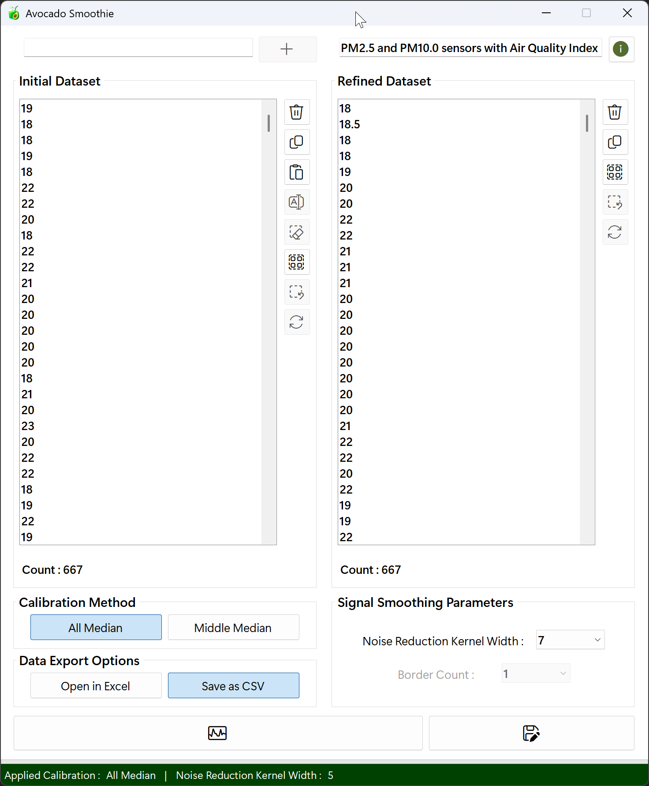
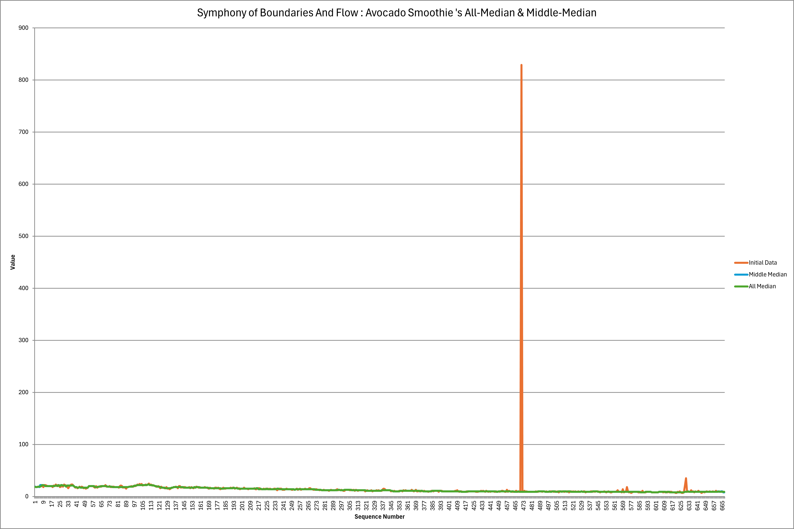

# AvocadoSmoothie
## The Art of Data Refinement That Preserves Only the Core
**AvocadoSmoothie** captures the essence of nature's avocado and the softness of a smoothie. Built on the running median algorithm, this project carefully extracts true signals from noisy data : just as only the pit remains at the center of a ripe avocado, leaving behind rough skins and excess in the blender.

**Key components**
- **Avocado** : Symbolizes a careful approach that targets only the central values of data, much like the dense seed hidden deep inside the fruit.
- **Smoothie** : Represents the graceful flow of an algorithm that blends complexity into a seamless whole, just like diverse ingredients harmonizing into one smooth drink.

**Technical Aesthetics**
- **RunningMedian** : Delivers stability and reliability by maintaining the central tendency, even in the face of abrupt spikes.

**Philosophical Foundation**
- **Gentle Refinement**<br>
Like living organisms, data requires delicate care. AvocadoSmoothie follows a soft-touch philosophy to ensure vital patterns aren't damaged by excessive processing.

- **Harmony Between Responsiveness and Stability**<br>
Like a well-balanced smoothie in taste and texture, this project aims to respond swiftly while also withstanding sudden fluctuations.

- **Clarity Through Vitality**<br>
By removing noise, AvocadoSmoothie breathes clarity and energy into your analysis : leading to better decisions and deeper insights, all through a nutritious blending process.

## Project Overview
This AvocadoSmoothie project delivers a highly optimized running median filter on numeric data held in a `ListBox`. Users pick a `kernel radius` and `border count`, then choose between two modes :<br><br>

AvocadoSmoothie now supports configurable boundary handling during full-range smoothing : <br><br>

- **AllMedian (Full Median)** : Applies the median filter at every index using a fixed kernel of width (2 × radius + 1). Out-of-range indices are synthesized according to the selected Boundary Mode (Symmetric reflection, Replicate, Zero Padding, or Adaptive). Adaptive mode shortens to a contiguous in-bounds window when the full kernel would extend past edges.  
- **MiddleMedian** : Preserves the first and last Border Count items verbatim and applies the same windowed median only to the interior region. Boundary modes are not applied because the preserved edges eliminate the need for synthetic padding.<br><br>

Thread-local window buffers, `Parallel.For`, and an allocation-minimized median routine deliver high throughput. A unified `ComputeMedians` method orchestrates both modes.<br><br>

Data can be entered one value at a time, bulk-pasted from the clipboard, or drag-and-dropped (with HTML-aware parsing). Internally, each sliding window is copied into a thread-local buffer and its median is obtained by Array.Sort on a temporary slice (legacy Quicksort remains in code but is not used on the median path). Filtering is parallelized across CPU cores using `Parallel.For` for maximum throughput.<br><br>
A real-time ProgressBar keeps the user informed, and UI updates (copy, delete, select-all, paste) are batched with `BeginUpdate` / `EndUpdate` to eliminate flicker. After each run, source and result lists are reset to guarantee repeatable behavior, making it effortless to visualize noise reduction or signal smoothing on the fly.<br><br>

> **Disclaimer :** This implementation uses a plain (equal-weight) median filter. For weighted-median calculations and a wider range of smoothing / correction methods, please refer to the **[SonataSmooth](https://github.com/happybono/SonataSmooth)** project. 

### Boundary Modes
| Mode | Behavior | Use Case |
|------|----------|----------|
| Symmetric | Mirrors indices past edges (reflective) | Smooth continuity at boundaries |
| Replicate | Clamps to nearest valid endpoint | Preserves plateaus / avoids mirror artifacts |
| Zero Padding | Treats out-of-range as 0.0 | Emphasize contrast; dampen edge influence |
| Adaptive | Crops the window so it stays fully within the dataset (effective W = min(kernelSize, n)) | Best for small datasets; avoids synthetic values by using only real data |

#### Index Mapping Examples
| Index (outside) | Symmetric            | Replicate        | Zero Padding | Adaptive                                |
|-----------------|----------------------|------------------|--------------|-----------------------------------------|
| -1              | maps to 1 (mirror)  | maps to 0        | 0.0          | Window cropped; out-of-range excluded   |
| n               | maps to n - 2       | maps to n - 1    | 0.0          | Window cropped; out-of-range excluded   |


Implementation details :
- Non-Adaptive modes always build a full kernel-size window, synthesizing each out-of-range slot via `GetValueWithBoundary`.
Adaptive computes the median over a contiguous in‑bounds slice:
  - start = clamp(i - offsetLow, 0, n - W)
  - W = min(kernelSize, n)

## Use Cases
AvocadoSmoothie is specialized for **1D numerical data smoothing and noise reduction**.  
Although limited to single‑dimension datasets, it can be applied in many domains where sequential numeric signals require preprocessing or refinement.

### 1. Machine Learning / Deep Learning Preprocessing
- **Problem** : Training datasets often contain spikes, jitter, or irregular noise.  
- **Solution** : Running Median filtering removes abrupt outliers while preserving meaningful patterns.  
- **Impact** : Improves model stability, reduces overfitting, and enhances generalization.

### 2. IoT & Sensor Data Stabilization
- **Problem** : Sensor outputs (temperature, vibration, humidity, etc.) are prone to random fluctuations.  
- **Solution** : Adaptive boundary handling ensures smooth results even with small datasets.  
- **Impact** : More reliable monitoring and higher accuracy in anomaly detection.

### 3. Financial & Economic Time Series
- **Problem** : Stock prices, exchange rates, and transaction volumes show high short‑term volatility.  
- **Solution** : Median filtering dampens extreme spikes while retaining long‑term trends.  
- **Impact** : Provides stable input for forecasting models and improves simulation reliability.

### 4. Scientific & Experimental Measurements
- **Problem** : Laboratory and field data often suffer from instrument noise or environmental interference.  
- **Solution** : Symmetric reflection and MiddleMedian modes refine data without distorting edge values.  
- **Impact** : Enables clearer pattern detection and strengthens research validity.

### 5. Audio / Signal Processing (1D only)
- **Problem** : Single‑channel signals or audio waveforms are vulnerable to peak noise.  
- **Solution** : Running Median removes salt‑and‑pepper style noise while preserving essential features.  
- **Impact** : Enhances post‑processing quality and improves signal analysis accuracy.

### 6. Data Visualization & Reporting
- **Problem** : Noisy datasets produce cluttered and misleading charts.  
- **Solution** : Median smoothing generates cleaner curves and more interpretable plots.  
- **Impact** : Delivers clearer insights and supports better decision‑making in reports.

<br>

<div align="center">
 


</div>

<br>

## What's New
<details>
<summary>Click to Expand</summary>

### v1.0.0.0
#### February 16, 2022
> Initial release.

#### February 17, 2022
> Fixed several bugs.

#### March 06, 2022
> Hi-DPI monitors support.

### v2.0.0.0
#### July 20, 2025
> Overhauled the graphical user interface.<br><br>
> Configurable `kernel width` and `border count` (combo‐boxes).<br><br>
> Regex utilities for numeric / HTML parsing.<br><br>
> Progress reporting via `ProgressBar` and `IProgress(Of Integer)`.<br><br>
> Async UI integration (`Async / Await` + `Task.Run`).<br><br>
> Thread‐local buffers and parallel loops (`Parallel.For`).<br><br>
> Replaced hard‐coded 5-point windows with parameterized `ComputeMedians`.<br><br>
> Switched from single‐threaded loops to `Parallel.For`.<br><br>
> Unified median logic : introduced `GetWindowMedian` with `Array.Sort`.<br><br>
> Bulk result population with `ListBox.Items.AddRange`.<br><br>
> Selection handlers to enable / disable edit, copy, delete and clear buttons.<br><br>
> Fully non-blocking median computation.<br><br>
> Dynamic window size reduces overhead.<br><br>
> Real‐time progress feedback (`ProgressBar`).<br><br>
> `StatusStrip` shows mode, `kernel width` and `border count`.

### v2.1.1.0
#### July 21, 2025
> Updated copy behavior : even when items aren't fully selected, pressing the copy button or using the shortcut (Ctrl + C) will copy all entries.<br>
(If only some items in the `ListBox` are selected, only those selected items will be copied.)<br><br>
> Minor bugs fixed.

### v2.1.2.0
#### July 22, 2025
> Improved bulk deletion performance in ListBox by optimizing the deletion logic for full selection scenarios.<br><br>
> Added a fast path to instantly clear all items and reset the progress bar when all entries are selected.<br><br>
> Ensured the progress bar and UI remain responsive during partial deletions of large datasets.<br><br>
> Minor bugs fixed.

### v2.2.3.0
#### July 22, 2025
> Refactored the btnInitPaste_Click handler to use PLINQ-based parallel parsing.<br><br>
> Optimized bulk insertion by replacing per-item adds with lbInitData.Items.AddRange.<br><br>
> Removed Task.Yield calls to eliminate unnecessary context switches.<br><br>
> Updated progress bar steps to 0 → 10 → 30 → 70 → 100 for clearer feedback.<br><br>
> Added enable / disable logic for Calculate, Copy, and Delete buttons to boost UI responsiveness and overall performance.

### v3.0.0.0
#### July 25, 2025
> Renamed all code elements, file names, and app metadata to reflect the new project name.<br><br>
> The project has been rebranded under its distinctive new name.<br><br>
> A new GitHub repository named AvocadoSmoothie has been created, and all necessary files have been relocated to it<br><br>
> The existing [RunningMedian](https://github.com/happybono/RunningMedian/) repository has been set to private.

### v3.1.0.0
#### July 25, 2025
> Replaced unsafe Val() parsing with Double.TryParse() to prevent overflow and ensure robust input validation.<br><br>
> Minor bugs fixed.

### v4.0.0.0
#### August 03, 2025
> Added `FrmAbout` displaying app version and copyright information.<br><br>
> Added `Buy Me a Coffee` feature via PayPal, integrated directly into the `FrmAbout` to support the developer.<br><br>

### v4.2.3.0
#### August 03, 2025
> Minor bugs fixed.

### v4.2.3.2
#### August 05, 2025
> Minor bugs fixed.

### v4.2.6.7
#### August 10, 2025
> The code has been refactored, and variable names have been redefined for improved clarity.<br><br>
> Include an ARM64-native variant of the executable.

### v4.2.7.0
#### August 15, 2025
> Updated UI labels by replacing "Kernel Width" with the more precise "Kernel Radius".<br><br>
> Refactored variable names and code references to use "Kernel Radius (r)" instead of "Kernel Width (w)".<br><br>
> Removed unnecessary `Task.Yield` calls to eliminate extra context switches and improve execution efficiency.<br><br>
> Improved Microsoft Office (Excel) installation detection and exception handling robustness.
> Minor bugs fixed.

### v4.3.0.0
#### August 20, 2025
> Implemented explicit COM object cleanup (`Application`, `Workbook`, `Worksheet`) with `Marshal.ReleaseComObject` and forced GC to prevent memory leaks and lingering background Excel processes.<br><br>
> Minor bugs fixed.

### v4.3.1.0
#### August 21, 2025
> Removed unused functions to streamline the codebase.<br><br>
> Retained early-stage/draft code as commented-out sections for reference and potential future use.<br><br>
> Minor bugs fixed.
 
### v4.6.3.8
#### August 24, 2025  
> Renamed UI controls for clarity and consistency (e.g., `ListBox1` → `lbInitData`).<br><br>
> Added dynamic description label (`slblDesc`) and tooltip support for better user guidance.<br><br>
> Deprecated `MiddleMedian()` and `AllMedian()` functions; replaced with unified `ComputeMedians()` logic.<br><br>
> Enhanced Excel export with metadata (title, author, comments) and fun flavor-based messages.<br><br>
> Improved error handling for Excel export (COM errors, permission issues, etc.).<br><br>
> Unified progress bar usage (`pbMain`) across calibration and export processes.<br><br>
> Improved selection synchronization and feedback between datasets.<br><br>
> Minor bugs fixed.

### v4.6.3.9
#### August 26, 2025
> Refreshed the graphical user interface with subtle enhancements.<br><br>
> Improved status label messaging logic : Added dynamic singular / plural phrasing and corrected punctuation for clearer user feedback.<br><br>
> Minor bugs fixed.

### v4.6.5.0
#### August 28, 2025
>	Implemented dataset title validation : including checks for length, invalid characters, and reserved names. Alongside dynamic placeholder behavior and conditional enabling of the export button.

### v4.6.5.1
#### September 2, 2025
> Minor bugs fixed.

### v4.6.6.0
#### September 7, 2025
> With the transition to ARM64 native based on `.NET Framework 4.8.1`, PCs running in this environment now deliver improved performance.<br><br>
> Since version `v4.6.3.8`, the correction value miscalculated when selecting the MiddleMedian method has been fixed to calculate correctly.

### v5.0.0.0
#### November 8, 2025
> Added boundary handling options : `Symmetric` (Mirror), `Adaptive`, `Replicate` (Nearest), `Zero Padding`.<br><br>
> Extended `ComputeMedians` to integrate boundary synthesis for AllMedian mode; introduced `BoundaryMode` enum and `GetValueWithBoundary` for edge sampling.<br><br>
> Minor bug fixes, performance improvements, and user interface enhancements.

### v5.0.1.0
#### November 9, 2025
> Revised and updated `README.md` documentation.<br><br>
> Minor bugs fixed.

### v5.1.2.0
#### November 15, 2025
> `StatusBar` now shows `Boundary Handling` options when using `All Median` mode.<br><br>
> Minor bugs fixed.
</details>

### v5.1.3.0
#### November 16, 2025
> Minor bugs fixed.

## Required Components & Setup
### Prerequisites
- [.NET Framework 4.8](https://dotnet.microsoft.com/en-us/download/dotnet-framework/net48) or 4.8.1 (target build uses 4.8.1; ARM64-compatible; earlier versions are not tested)
- Windows Operating System (Windows 10 or later recommended)
- [Visual Studio 2019 or newer](https://visualstudio.microsoft.com/) (for development)
- [Microsoft Office (Excel)](https://www.microsoft.com/en/microsoft-365/) - **Required for Microsoft Excel export functionality** via `Interop`

### Dependencies
- `System.Windows.Forms`
- `System.Threading.Tasks`
- `System.Linq`
- `Microsoft.Office.Interop.Excel` (for Excel export)

### Initial Setup
- Clone or download the repository.
- Open the solution file (`.sln`) in Visual Studio.
- Add necessary references if required.
- Build the project.
- Run the application.

## Execution Instructions
1. **Launch the Application** : Run the compiled `.exe` file or start the project from Visual Studio.
2. **Input Data** : Enter numeric values manually, paste from clipboard, or drag-and-drop text / HTML.
3. **Select Filter** : Choose a smoothing algorithm and configure kernel radius and border count.
4. **Calibrate** : Click the 'Calibrate' button to apply the selected filter.
5. **Review Results** : View the smoothed output in the second listbox.
6. **Export** : Click Export to save results as `.CSV` or `Excel (.xlsx)`, with optional chart visualization.

## Pascal Weighted Median vs. Standard Median
### Which Types of Graphs Benefit from Each Method?
| Graph Type              | Standard Median      | Pascal Weighted Median    |
|:------------------------|:---------------------|:--------------------------|
| Occasional Noise        | Effective            | Effective                 |
| Frequent Noise          | Strong filtering     | Sensitive to distortions  |
| High local variation    | Can suppress trends  | Captures trends well      |
| Sudden spikes           | Ignores outliers well| May amplify outliers      |

- The **standard median** is great for filtering noise in data with frequent or unpredictable spikes : such as images or sensor readings.
- The **Pascal theory based weighted median** shines when the data has meaningful local structure, like time series that need trend preservation.

### Why Is the Pascal Triangle Weighted Median More Sensitive to Noise?
A **Pascal triangle-based weighted median** assigns weights to each element : typically giving higher weight to values near the center of the window.

- Advantage : Better preserves local trends within the data.
- Downside : Noisy spikes near the center get too much influence, leading to distortion.

In comparison:
- A **[standard median](https://github.com/happybono/AvocadoSmoothie/)** simply picks the middle value, so random spikes are more easily ignored.
- A **[weighted median](https://github.com/happybono/SonataSmooth/)**, especially with Pascal-style weights, might over-represent noisy points if they're close to the center.

### Which Method Is Commonly Used in Practice?
Depending on the field, practitioners choose based on context :

- Image processing / video filtering
  - Standard median is widely used
  - Removes salt-and-pepper noise effectively

- Time-series smoothing (e.g. stock prices, IoT sensors, EEG signals)
  - Weighted approaches, including Pascal triangle, are preferred
  - Smooths data while preserving trends

- Experimental data correction
  - Often combines both methods
  - Hybrid strategies handle complex noise patterns more flexibly

## Features
- Import numeric data effortlessly via copy / paste or drag-and-drop from Excel and other spreadsheet apps (HTML / text parsing built-in).
- Choose kernel radius and border count, then click the `Calibrate` button to apply the running median filter.
- Two filter modes : **MiddleMedian** (preserve first / last values) or **AllMedian** (full-range smoothing).
- High-performance parallel processing with a thread-local buffer and `Array.Sort`-based median selection (`GetWindowMedian`).
- Real-time `ProgressBar` feedback and flicker-free UI updates using `BeginUpdate` / `EndUpdate.`
- Source and result lists reset after each run for consistent, repeatable behavior.

## Features & Algorithms
### 1. Initialization & Input Processing
#### How it works
When the application starts, users can input numeric data through various methods : direct text entry, clipboard paste, or drag-and-drop. The input values are parsed and stored in the internal initList, and displayed in lbInitData for review and editing.

#### Principle
-	Input data is added to `lbInitData` and internally stored in the initList list.
-	Input can be received via the textbox, clipboard, or drag-and-drop.
-	Only numeric values are extracted using regular expressions for robust parsing.

#### Code Implementation
```vbnet
' Add value from TextBox
Private Sub btnInitAdd_Click(sender As Object, e As EventArgs) Handles btnInitAdd.Click
    Dim v As Double
    If Double.TryParse(txtInitAdd.Text, v) Then
        lbInitData.Items.Add(v)
        lblInitCnt.Text = $"Count : {lbInitData.Items.Count}"
    End If
    txtInitAdd.Clear()
End Sub

' Paste from clipboard (parallel parse)
Private Async Sub btnInitPaste_Click(sender As Object, e As EventArgs) Handles btnInitPaste.Click
    Dim text As String = Clipboard.GetText()
    Dim matches = regexNumbers.Matches(text).Cast(Of Match)().Where(Function(m) m.Value <> "").ToArray()
    Dim values As Double() = Await Task.Run(Function()
        Return matches.AsParallel().
            WithDegreeOfParallelism(Environment.ProcessorCount).
            Select(Function(m) Double.Parse(m.Value, Globalization.NumberStyles.Any, Globalization.CultureInfo.InvariantCulture)).
            ToArray()
    End Function)
    If values.Length = 0 Then Return
    lbInitData.BeginUpdate()
    lbInitData.Items.AddRange(values.Cast(Of Object).ToArray())
    lbInitData.EndUpdate()
    lblInitCnt.Text = $"Count : {lbInitData.Items.Count}"
End Sub

' Drag & drop (HTML aware)
Private Async Sub lbInitData_DragDrop(sender As Object, e As DragEventArgs) Handles lbInitData.DragDrop
    Dim raw As String = If(e.Data.GetDataPresent("HTML Format"),
                           regexStripTags.Replace(e.Data.GetData("HTML Format").ToString(), ""),
                           e.Data.GetData(DataFormats.Text).ToString())
    Dim parsed As Double() = Await Task.Run(Function()
        Return regexNumbers.Matches(raw).
            Cast(Of Match)().
            AsParallel().AsOrdered().
            Select(Function(m)
                       Dim tok = m.Value.Replace(",", "").Trim()
                       Dim d As Double
                       Return If(Double.TryParse(tok, Globalization.NumberStyles.Any, Globalization.CultureInfo.InvariantCulture, d), d, Double.NaN)
                   End Function).
            Where(Function(d) Not Double.IsNaN(d)).
            ToArray()
    End Function)
    If parsed.Length = 0 Then Return
    lbInitData.BeginUpdate()
    lbInitData.Items.AddRange(parsed.Cast(Of Object).ToArray())
    lbInitData.EndUpdate()
    lblInitCnt.Text = $"Count : {lbInitData.Items.Count}"
End Sub
```

### 2. What is Kernel Radius
#### Definition
In a median filter, `kernelRadius` specifies how many elements are taken on each side of the center element when creating the median window.
  
#### Kernel Size Formula
The width of a kernel is calculated using the following formula :

$$
\text{kernelWidth} = 2 \times \text{kernelRadius} + 1
$$

#### Example
If the kernel radius is **2**, then :

$$
\text{kernelWidth} = 2 \times 2 + 1 = 5
$$

Therefore, the kernel width (computed from the radius) is **5**.

#### Meaning
- The filter includes the current element plus `kernelRadius` elements before it and after it.
- This ensures the total window size is always odd, so there's a single middle value.

#### Benefit
- `kernelRadius` makes it easy to reason about how far to extend the filter around the center point.
- It helps in handling edge conditions without ambiguity.

### 3. AllMedian Calculation
#### How it works
For each index i, a window of size (2 × radius + 1) is populated. Out-of-range positions are resolved via the selected Boundary Mode (except Adaptive, which shortens the window). Parallel threads reuse thread-local buffers to avoid allocations.

#### Principle
1. Compute offsets :
   offsetLow = (kernelSize - 1) \ 2
   offsetHigh = (kernelSize - 1) - offsetLow
2. If boundaryMode = Adaptive :
   - W = min(kernelSize, n)
   - Determine a valid contiguous start
   - Copy W in-bounds values
3. Else :
   - For each relative position k :
     win[k] = GetValueWithBoundary(arr, i + k - offsetLow, boundaryMode)
4. Median = GetWindowMedian(win, effectiveLength)

#### Key Distinction
Edge indices no longer "shrink" by clamping; synthetic sampling abstracts the boundary so every window (except Adaptive) stays full-sized.

#### Code Implementation
```vbnet
' All-points median smoothing example (boundary mode explicitly provided)
ComputeMedians(useMiddle:=False,
               kernelSize:=2 * radius + 1,
               borderCount:=0,
               progress:=progress,
               boundaryMode:=BoundaryMode.Symmetric)

Private Sub ComputeMedians(useMiddle As Boolean,
                           kernelSize As Integer,
                           borderCount As Integer,
                           progress As IProgress(Of Integer),
                           Optional boundaryMode As BoundaryMode = BoundaryMode.Symmetric)
    Dim n = initList.Count
    If n = 0 Then progress.Report(0) : Return

    Dim arr = initList.ToArray()
    Dim buffer(n - 1) As Double
    Dim offsetLow  = (kernelSize - 1) \ 2
    Dim offsetHigh = (kernelSize - 1) - offsetLow

    ' Thread-local buffer to avoid per-iteration allocations
    Dim localWin As New ThreadLocal(Of Double())(
        Function() New Double(KernelSize - 1) {})

    Parallel.For(0, n, Sub(i)
        Dim win = localWin.Value
        If boundaryMode = BoundaryMode.Adaptive Then
            Dim desiredW As Integer = kernelSize
            Dim W As Integer = Math.Min(desiredW, n)
            Dim start As Integer = i - offsetLow
            If start < 0 Then start = 0
            If start > n - W Then start = n - W
            For pos As Integer = 0 To W - 1
                win(pos) = arr(start + pos)
            Next
            buffer(i) = GetWindowMedian(win, W)
        Else
            For pos As Integer = 0 To kernelSize - 1
                Dim k As Integer = pos - offsetLow
                win(pos) = GetValueWithBoundary(arr, i + k, boundaryMode)
            Next
            buffer(i) = GetWindowMedian(win, kernelSize)
        End If
    End Sub)

    refinedList.Clear()
    refinedList.AddRange(buffer)
End Sub

Private Function GetWindowMedian(win() As Double, length As Integer) As Double
    Dim slice = win.Take(length).ToArray()
    Array.Sort(slice)
    Dim mid = length \ 2

    If length Mod 2 = 0 Then
        ' even → average two middle elements
        Return (slice(mid - 1) + slice(mid)) / 2.0
    Else
        Return slice(mid)
    End If
End Function
```

### 4. MiddleMedian Calculation
#### How it works
MiddleMedian preserves the first and last `borderCount` elements unchanged, then applies the same median filter only to the inner region. It calls the **same** `ComputeMedians` routine with `useMiddle:=True`.

#### Principle
Copy boundary elements directly :
buffer(0 … borderCount - 1) = arr(0 … borderCount - 1)
buffer(n - 1 … n - borderCount) = arr(n - 1 … n - borderCount)
Run the sliding-window median on indices [borderCount … n - borderCount - 1]
Filtering logic and median selection are identical to `AllMedian`

#### Code Implementation
```vbnet
ComputeMedians(useMiddle:=True,
               kernelSize:=2 * radius + 1,
               borderCount:=borderCount,
               progress:=progress)

' Inside ComputeMedians (simplified):
If useMiddle Then
    For i = 0 To borderCount - 1
        buffer(i) = arr(i)
        buffer(n - 1 - i) = arr(n - 1 - i)
    Next
End If

startIdx = borderCount
endIdx   = n - borderCount - 1

Parallel.For(startIdx, endIdx + 1, Sub(i)
    ' Legacy edge behavior: variable effective length near borders
    Dim iMin = Math.Max(0, i - offsetLow)
    Dim iMax = Math.Min(n - 1, i + offsetHigh)
    Dim length = iMax - iMin + 1
    Dim win = localWin.Value
    For k = 0 To length - 1
        win(k) = arr(iMin + k)
    Next
    buffer(i) = GetWindowMedian(win, length)
End Sub)
```

### 5. Border Count
When you apply the Running Median filter, the **Border Count** parameter lets you exempt a fixed number of points at each end of your series from filtering. This helps you avoid unwanted edge distortion and preserves known "safe" values at the start and finish.

- Definition  
  The number of data points to leave unchanged at both the beginning and the end of the sequence.

- Type  
  Integer, 0 ≤ Border Count < ⌊n / 2⌋

- Default  
  0 (no edge preservation : all points are filtered)

#### Notes

- If your series length is less than 2 × Border Count, the filter will skip processing entirely.  
- Choose a small k (e.g. 1 - 5) when you trust your edge data but still need robust spike suppression in the center.

#### Behavior

If you set `Border Count = k`, then :  
- The first **k** samples remain exactly as they are.  
- The last **k** samples remain exactly as they are.  
- Only the middle section (everything between those preserved edges) is passed through the median filter.

#### Example

```txt
Original data (10 points) :   [x₀, x₁, x₂, x₃, x₄, x₅, x₆, x₇, x₈, x₉]
Border Count = 3

Preserved by Border Count :   [x₀, x₁, x₂]                [x₇, x₈, x₉]
Filtered by Running Median :              [x₃, x₄, x₅, x₆]
```

### Enhanced Parameter Validation & Single-Display Error Gating
`ValidateSmoothingParametersCanonical` builds a radius-derived window size and enforces:
- windowSize ≤ dataCount
- borderCount ≤ dataCount
- (Middle mode) 2 × borderCount < windowSize

Errors use standardized builders :
- BuildParamErrorWindowTooLarge
- BuildParamErrorBorderTooLarge
- BuildParamErrorBorderWidth

Duplicate dialog spam is prevented with `MessageOnceGate`, allowing the same message only once within a timed interval.

Rules Summary :
- windowSize = (2 × radius) + 1
- Middle mode border width = 2 × borderCount
- Require : windowSize ≤ dataCount AND borderCount ≤ dataCount AND (Middle) 2 × borderCount < windowSize

### Dataset Title Validation
Titles must:
- Be non-empty (placeholder replaced on first edit)
- ≤ 31 characters
- Exclude : \ / ? * [ ] and any Windows invalid filename chars
- Avoid reserved names (CON, PRN, AUX, NUL, COM1 - COM9, LPT1 - LPT9)

On invalid input :
- Title reverts to placeholder
- A single warning dialog appears (duplicate suppression via internal gating).

### Results Aggregation & UI Update
#### How it works
Once `ComputeMedians` completes on a background thread, the UI thread :
Clears and repopulates `lbRefinedData` in one batch
Scrolls `lbRefinedData` so the last element is visible
Updates count labels, summary labels, and button states
Shows a brief 200 ms delay before resetting the progress bar to 0

#### Principle
- Repopulate lbRefinedData using AddRange(refinedList)
- Set lbRefinedData.TopIndex to the last item index
- Update :
    - `lblInitCnt` and `lblRefCnt` with total and refined counts
    - `slblCalibratedType` to "Middle Median" or "All Median"
    - `slblKernelRadius` with the chosen radius
    - `slblBorderCount` with the border count (visible only in middle‐median mode)
  - Toggle visibility of `slblBorderCount`, `tlblBorderCount` and `slblSeparator2` based on mode
  - Refresh button states via `UpdatelbInitDataButtonsState` and `UpdatelbRefinedDataButtonsState`
  - Delay 200 ms to let users see "100% complete", then reset `pbMain.Value`

#### Code Implementation
```vbnet
Private Async Sub btnCalibrate_Click(sender As Object, e As EventArgs) Handles btnCalibrate.Click
    ' ... prepare initList, parameters, and pbMain
    
    Await Task.Run(Sub()
        ' kernelWidth = 2 * radius + 1
        ComputeMedians(useMiddle, kernelWidth, borderCount, progress,
                       If(useMiddle, BoundaryMode.Symmetric, GetSelectedBoundaryMode()))
    End Sub)

    ' Refresh lbRefinedData
    lbRefinedData.BeginUpdate()
    lbRefinedData.Items.Clear()
    lbRefinedData.Items.AddRange(refinedList.Cast(Of Object).ToArray())
    lbRefinedData.EndUpdate()

    ' Scroll to last item
    lbRefinedData.TopIndex = lbRefinedData.Items.Count - 1

    ' Update count labels
    lblInitCnt.Text = $"Count : {total}"
    lblRefCnt.Text = $"Count : {refinedList.Count}"

    ' Update summary labels
    slblCalibratedType.Text = If(useMiddle, "Middle Median", "All Median")
    slblKernelRadius.Text = Integer.Parse(cbxKernelRadius.Text)
    slblBorderCount.Text = $"{borderCount}"

    ' Toggle visibility of border‐related labels
    slblBorderCount.Visible = useMiddle
    tlblBorderCount.Visible = useMiddle
    slblSeparator2.Visible = useMiddle

    ' Refresh UI button states
    UpdatelbInitDataButtonsState(Nothing, EventArgs.Empty)
    UpdatelbRefinedDataButtonsState(Nothing, EventArgs.Empty)

    ' Brief UX pause, then reset progress bar
    Await Task.Delay(200)
    pbMain.Value = 0
End Sub
```

### Implementation Details
#### Input Handling
- Manual Entry  
  The `btnInitAdd_Click` handler and `txtInitAdd_KeyDown` allow users to type a numeric value into `txtInitAdd` and press Enter or click Add. Valid numbers are parsed via `Double.TryParse` and appended to `lbInitData`.
  
- Clipboard Paste  
  The `btnInitPaste_Click` event reads `Clipboard.GetText()`, uses `regexNumbers` to match numeric tokens, then parses them in parallel (`AsParallel().WithDegreeOfParallelism`) before adding to `lbInitData` in a batch (`BeginUpdate` / `EndUpdate`).

- Drag & Drop  
  The `lbInitData_DragDrop` handler checks for "HTML Format" or plain text, strips tags via `regexStripTags`, extracts numbers via `regexNumbers.Matches`, parses in a background task, and calls `AddItemsInBatches` to insert items with incremental progress.

- Regex-Based Filtering  
  Two compiled regexes are used :  
  - `regexStripTags` to remove HTML / XML tags.  
  - `regexNumbers` to find `"[+-]?(\\d+(,\\d{3})*|(?=\\.\\d))((\\.\\d+([eE][+-]\\d+)?)|)"` and extract numeric substrings.

#### Smoothing Workflow
When the user clicks **Calibrate** (`btnCalibrate_Click`) :

1. Convert each lbInitData.Items entry to Double and store in initList.
2. Read cbxKernelRadius (radius) and compute kernelWidth = (2 × radius) + 1.
3. Read cbxBorderCount and parse borderCount.
4. Validate parameters with ValidateSmoothingParametersCanonical(n, radius, borderCount, useMiddle).
5. Initialize pbMain and create Progress(Of Integer) to update it.
6. Run ComputeMedians(useMiddle, kernelWidth, borderCount, progress,
   If(useMiddle, BoundaryMode.Symmetric, GetSelectedBoundaryMode())) on the thread pool.
7. Populate lbRefinedData with refinedList, update labels (lblInitCnt, lblRefCnt, slblCalibratedType, slblKernelRadius, slblBorderCount), then reset pbMain.

#### Filter Algorithm Implementation
##### Core Routine : ComputeMedians
- Middle-Median (`useMiddle = True)` Copies the first and last `borderCount` points unmodified to buffer. Applies a sliding window of width `KernelRadius` only to indices [borderCount … n - borderCount - 1].

- All-Median (`useMiddle = False`) Applies the sliding window at every index using boundary synthesis to keep a full fixed-size window (Symmetric / Replicate / Zero Padding); Adaptive crops to a contiguous in-bounds window.

Both modes share :
1. A thread-local window buffer (ThreadLocal(Of Double())) to avoid per-iteration allocations.
2. A Parallel.For loop distributing indices across CPU cores.
3. Median selection via GetWindowMedian : Array.Sort a slice; odd → middle element, even → average of two middles.

Edge handling differs :
- MiddleMedian (useMiddle = True) : copies preserved borders; interior windows use clamped iMin / iMax (variable length).
- AllMedian (useMiddle = False) : builds a full fixed-size window using BoundaryMode synthesis (Symmetric, Replicate, Zero Padding). With Adaptive, it crops to a contiguous in-bounds window of size W = min(kernelSize, n).

##### Core Median Functions  
- `GetWindowMedian(win() As Double, length As Integer)` Creates a temporary slice of length elements from win, sorts with Array.Sort, and returns :
    - `slice(mid)` if `length` is odd
    - `(slice(mid - 1) + slice(mid)) / 2.0` if even
- `Quicksort(list() As Double, min As Integer, max As Integer)` remains in the codebase but is no longer used by ComputeMedians.
 
#### Parallel Processing & UI Responsiveness
- Median computation leverages `Parallel.For` with thread-local buffers.
- Text parsing uses PLINQ (`.AsParallel().WithDegreeOfParallelism(Environment.ProcessorCount)`).
- Progress updates flow through `IProgress(Of Integer)` into `pbMain`.
- `BeginUpdate` / `EndUpdate` on both listboxes prevent repaint flicker.
- Background work is offloaded via `Task.Run` / `Await`; small `Task.Delay(1)` calls within batch routines yield to the UI thread.
- Deletion and selection routines use `Application.DoEvents()` to process pending Windows messages during lengthy operations.

#### Legacy Quicksort
Internally, each sliding window is copied into a thread-local buffer and its median is extracted using Array.Sort over a temporary slice. A legacy Quicksort implementation remains in code for reference but is not used on the median path.

#### Export Functionality
##### General Export Settings
- Choose format via `rbtnCSV` or `rbtnXLSX`.
- `cbxKernelRadius` and `cbxBorderCount` must parse to valid integers before export.
- Dataset title is taken from `txtDatasetTitle` (placeholder is shown until edited).

##### CSV Export (`ExportCsvAsync`)
- Loads initial data from `lbInitData` into a `Double()` array.
- Computes both series : MiddleMedian (`ComputeMedians(True, …)`) and AllMedian (`ComputeMedians(False, …)`).
- Splits output into multiple files when rows exceed Excel’s 1,048,576 limit (reserving 12 header lines).
- Writes UTF-8 CSV with :
  - Title
  - Part X of Y
  - Smoothing parameters (Kernel Radius, Kernel Width, Border Count, Boundary Method)
  - Timestamp
  - Header line : `Initial Data,MiddleMedian,AllMedian`
- Robustness :
  - Retry loop on `IOException` (file in use) with Retry / Cancel.
  - Auto-opens each generated file; falls back to `rundll32 shell32.dll,OpenAs_RunDLL` if no association.

##### Excel Export (`btnExport_Click` with `rbtnXLSX`)
- Validates and reads parameters and initial data, then computes MiddleMedian and AllMedian.
- Creates Excel `Application` → `Workbook` → first `Worksheet`.
- Writes sheet header :
  - A1 : dataset title
  - Row 3 : "Smoothing Parameters"
  - Rows 4 - 7 : Kernel Radius, Kernel Width, Border Count, Boundary Method
- Writes data with `WriteDistributed` :
  - Splits each series across adjacent columns when exceeding 1,048,576 rows per column.
- Visualization :
  - Inserts a line chart (`xlLine`) with three series (Initial, MiddleMedian, AllMedian), titled and labeled axes.
- Document metadata :
  - Built-in properties (Title, Category, Subject, Author, Last Author, Keywords, Comments).
  - Flavor-themed comments with "achievement" tiers by dataset size.
- Cleanup :
  - Explicit COM release via a stack and `Marshal.FinalReleaseComObject`.
  - Double GC pass to avoid lingering Excel processes.
  - Makes Excel visible and enables alerts.
 
#### Keyboard Shortcuts
- Ctrl + C - Copy selected or all items to clipboard (Initial and Refined).
- Ctrl + V - Paste numeric data into Initial dataset.
- Ctrl + A - Select all items (Initial and Refined).
- Delete - Delete selected items in Initial dataset.
- Ctrl + Delete - Clear all items (Initial → Initial dataset, Refined → Refined dataset).
- F2 - Edit selected item(s) (FrmModify) in Initial dataset.
- Esc - Deselect selection (Initial and Refined).

### Data Handling and Processing
- Efficiently processes numeric data for running median calculations
- Supports data input via :
  - Direct entry
  - Clipboard paste
  - Drag-and-drop
- Validates numeric values using regular expressions
- Stores data as a list of doubles for high-precision calculations
- Provides two types of running median filters :
  - AllMedian :
    - Calculates a median at every position using a sliding window
    - Uses Boundary Modes (Symmetric / Replicate / Zero Padding) for synthetic edge sampling; Adaptive crops the window in-bounds
  - MiddleMedian :
    - Applies the median filter only to interior indices
    - Preserves a user-defined number of edge elements (border count) unchanged

### User Interface and Interaction
- Main window includes :
  - `ListBox` for input data
  - `ListBox` for displaying results
- Data points can be :
  - Added, edited, or deleted via buttons or keyboard shortcuts
- Bulk editing supported via modal dialog for multi-value modification
- Data selection, copying, and clearing available via one-click or keyboard shortcuts
- Real-time feedback provided through `ProgressBars` and `StatusLabels`
- Interface dynamically enables / disables controls based on context to prevent errors

### Customization and Configuration
- Kernel radius adjustable for filtering (kernel width = 2 × radius + 1)
- Boundary exclusion configurable when using MiddleMedian
- Filter type (`AllMedian` or `MiddleMedian`) can be switched using radio buttons
- Interface auto-adjusts available settings to match selected filter
- All settings applied instantly for immediate data visualization and experimentation

### Contextual UX Enhancements
- Dynamic status label (`slblDesc`) with singular / plural grammar and contextual verbs.
- Tooltip-like hover behavior implemented through event handlers rather than static ToolTip control.
- Selection synchronization buttons (`btnInitSelectSync`, `btnRefSelectSync`) mirror selected indices across datasets.
- ProgressBar reused uniformly for paste, drag-drop, deletion, selection-all, calibration, and export for consistent user mental model.

## Conclusion
AvocadoSmoothie delivers a seamless, high-performance Windows Forms experience for running median calculations on numeric datasets. It combines flexible data ingestion (manual entry, clipboard paste, drag-and-drop) with two smoothing modes : Middle Median (preserving edge values) and All Median (adaptive windowing) : to transform noisy signals into clear, consistent outputs.

Key highlights :
- Robust border handling that avoids edge artifacts without dropping data points.
- Multithreaded execution via `Parallel.For`, PLINQ and asynchronous UI updates for maximum throughput.
- Real-time progress reporting and flicker-free batch rendering to keep users informed and the interface smooth.
- Flexible export options : split CSV files for very large datasets or full-featured Excel workbooks with automatic chart generation.

Together, these features empower users to interactively refine their data, fine-tune smoothing parameters, and export polished results : making AvocadoSmoothie a reliable, efficient component in any data-analysis or preprocessing workflow.  

## Principle Demonstration
<div align="center">
  <a href="https://vimeo.com/693794659" title="Data Calibration Demo Using the running median Method - Click to Watch">
    
  </a>
</div>

## Demonstration
<br><br>
<br><br>
<br><br>
<br><br>


## License
This project is licensed under the MIT License. See the `LICENSE` file for details.

## Copyright 
Copyright ⓒ HappyBono 2022 - 2025. All Rights Reserved.
